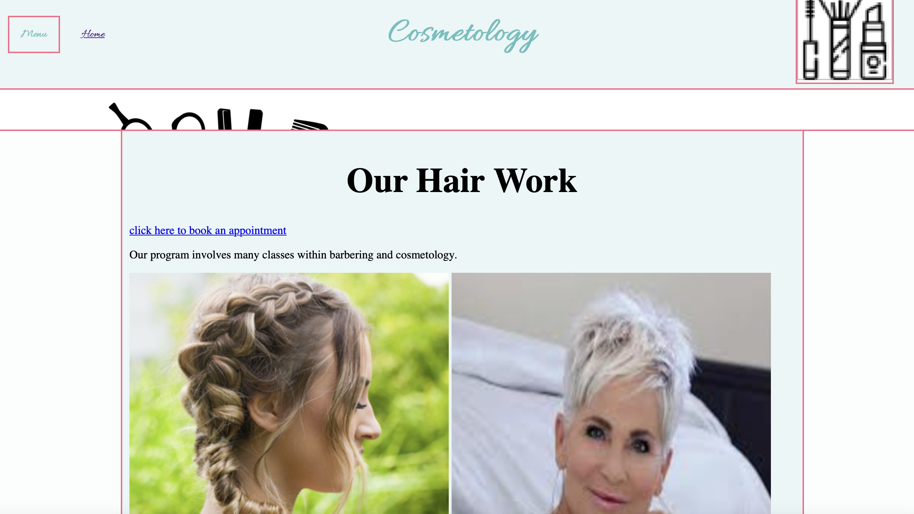
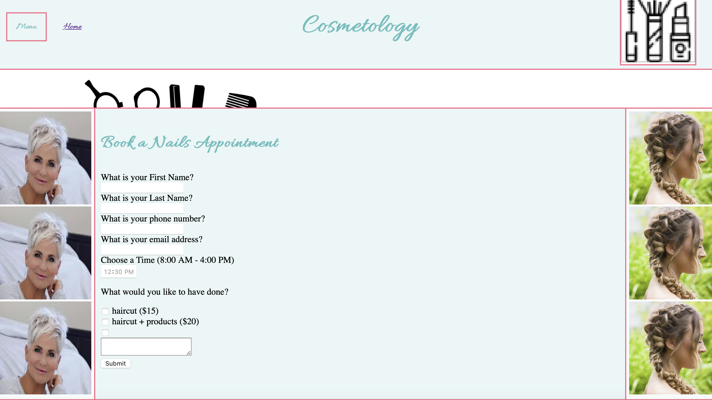

# This is my entry for how this project went.

I had a fun time working on this project especially because it was fun to be working with a friend. Even though we were creating different pages we were still on the same team. We didn't run into any trouble with pull requests and merging.
[project]

The form was easy to make, we used the same layout for the forms like same type of questions and such. When I had trouble with the forms Charlie was able to help me out because he is good at making forms.
